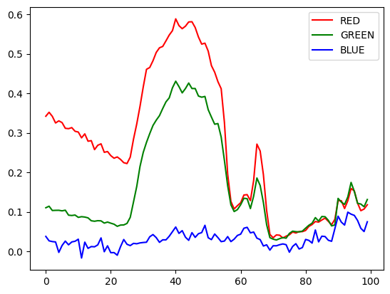

# RGB Inter channel correlation in EXR RGB-half images

Considering an RGB raster visual image. There are typically three type of correlation that can be used:

- Spatial. Pixels close to each other in the raster typically take similar values esp when the resolution is high.
- Temporal. Pixels on the same location of the raster typically take similar values between frames of the same shot.
- Spectral. Pixel’s R-G-B channel values typically go up (brighter) and down (darker) together both spatially and temporally.

The spatial correlation is represented by the existing byte swizzle, while the temporal correlation would require out-of-file knowledge of other EXR frames in the same shot. However, I realized No.3 is unexplored in EXR's RGB-half images. 

The fundamental spectral correlation of the RGB images, of course, is well understood, with the prominent application case being the chromaticity-separated color spaces for varying bitrate transfers. For example, in the YUV transferring model commonly used for older PAL TVs, the luminance Y is separated from the chromaticity UVs, then encoded with a higher bitrate. The rationale is that, in lossy encoding, vision perception is more sensitive to luminance than chromaticity.

While we are not considering any perception based lossy encoding, or any color space transformation here, the fundamental correlation between the RGB channel remains. This brings out an interesting topic: this correlation can either be exploited by transforming the color space (such that the Y-luminance and UV-chromaticity is de-correlated and separately coded), or by changing the compression encoding.

_De-correlation by encoding_ for RGB color channels in images has been explored some twenty years ago. The first paper i identified here is from 2002 (20+ years ago!); the second paper is a 2007 discussion on the same topic, and compare it with chromaticity-separated color space encodings:

1. [Color image compression using inter-color correlation.](../resources/Intercolor.pdf)
2. [Correlation vs. decorrelation of color componenets in image compression - which is preferred?](../resources/correlation/b2l-f03.pdf)

## Separate prefiltering and lossless compression

Conceptually the EXR compression process can be thought of as _two stages_. This conceptual model is applicable for other lossless compression use cases too: 

1. A *prefiltering* step, such as the simple byte swizzle in EXR, that exploits this specific type of signal’s intrinsic property/preknowledge (domain knowledge), such as the spatial correlation. This step prepares an optimized byte stream from the next step.
2. A *generic* lossless encoding step; this step takes an arbitrary byte stream and attempt to produce the shortest lossless encoding of this byte stream. This encoder/compressor does not need to understand any domain knowledge and can be sourced from off-the-shelf/commercial solutions, such as libdeflate/zstd. This encoder should also be easily upgradable for a domain library (EXR) when a new version of off-the-shelf generic compressor become available from other communities.

This isn’t implemented in the original EXR’s zip code, which hardwired step 1 and 2 into an inseparable zip compression type that only works on RGB-half. Understandably, the deep data was added by contributors outside ILM, so ILM’s original code did not need to consider arbitrary data types other than RGB-half.

Pre-filtering is a common strategy if there is any domain knowledge beyond assuming the data is an arbitrary byte stream. It is noted that blosc2 has a float targeted byte swizzle as a prefiltering step before compression (which doesn’t work on half), see my comments on EXR repo’s Zstd PR: https://github.com/AcademySoftwareFoundation/openexr/pull/1604#issuecomment-1897865375

(Note that this is a prefiltering in blosc2, not in Zstd. Zstd is general purpose and does not assume any byte pattern).


## Explore correlation with EXR RGB-half images

An excerpt line of pixels from the ACES-Stilllife benchmark EXR (x=500, y=200:300) shows definitive correlation between R-G for yellow-ish regions of colors:



The question here is how to exploit this inter-channel correlation in a prefiltering step, while continue to support the existing principle of spatial correlation prefiltering (byte-swizzle).

Conceptually, the strategy should be:
1. Choose one channel as the _pivot_.
2. Build two lossless _predictors_ based on the pivot.
2. Compress the pivot by itself, but for the other two channels, we only need to compress the _prediction residue_, which should contain less information than the original channel before the prediction, if the predictor was done right.

The following two simplifications are used in the current research:

1. We always choose G channel as the pivot, as it sits in the middle of the specturm and overlaps both R and B in its CIE function. Adaptive pivot choosing has been explored in the literature and seems offering marginal benefit.

2. The simpliest (zero-order) predictor is a diff; e.g. the residue is (G-R) or (G-B). **This will be a completely local predictor (there are no inter-pixel dependency of the prediction) and suites well for SIMD/parallel programming.** 

However, the preditor here can take more forms than arithmetic subtraction of two half floats. The construction of this predictor is discussed in detail below.

## Making the (zero-order) predictor

Using G as the pivot and denote the residue of R and B as R' and B'. The predictor can be made in a few ways:

1. Arithmetic subtraction: R' = G - R and B' = G - B, all operations with half floating numbers. Note this might incur floating point error (shift) during reconstruction, so I am not proceed with this strategy.
2. Only subtract the high bit but not the lower bit: R'<sub>lo</sub> = R<sub>lo</sub> but R'<sub>hi</sub> = G<sub>hi</sub> - R<sub>hi</sub>. Subtraction using signed short semantics (e.g. keep the sign bit's meaning but pack exponent + first two mantissa bits as an int).

This strategy is from the thought that the lower bits of mantissa might be quite random and it has little value try to predict these mantissa bits using another channel.

3. We can further simplify that subtraction by using a bit diff, aka, **XOR**. R'<sub>lo</sub> = R<sub>lo</sub> and R'<sub>hi</sub> = G<sub>hi</sub> XOR R<sub>hi</sub>. This could provide further performance boost and enable more straightforward SIMD implementation.

The byte swizzle can continue to be enabled, such that all the three channels after prediction (original G, residue R' and B') are byte-swizzled before entering the general purpose encoder. 

The current investigation is to plot the R-B residue (just the high bit) from strategy 2 and 3 and compare their complexity. If 2 appears to be similar to 3 then 3 is preferred due to the faster performance of XOR. 

## Prelimiary experiment results

I did the comparsion of byte subtraction v.s. XOR on a down-sized data set (one scanline from an example image). I realized an important point for subtraction to work better -- arithmetic subtraction respect first degree similiarities between the two signals, while XOR does not.

Consider the following example:

```
S1 = 66
S2 = 26
delta = 8
S1 xor S2 = 0x58
(S1 + delta) xor (S2 + delta) = 0x68
```

With arithmetic subtraction, if the two singals are increasing or decrasing at the same pace after sample, the subtraction result remain the same, and will be eliminated by the subsequent delta-encoding (`s'=s[i+1]-s[i]`) step. But with XOR, it results in a new token and remains a new, none-zero token after delta-encoding. Therefore i think arithmetic subtraction is a better zero-order predictor for RGB correlation than XOR.

## Next step: Benchmark methodology.

We only benchmark the pre-filtering and therefore we only generates bytestream files on disk, then use any general purpose standalone bins to compress them.

We do not consider the full file byte structure (yet). Here we assume that we are given a sequence of RGBA-half pixels (either tile or scanline) and we focus on the low-level byte/bits construction/filtering of the bytestream.

According to the above prelimiary investigation, the following bytestream patterns are to be benchmarked.

1. Original - `RGBARGBARGBA...RGBA`
2. Channel separated - `RRRR...GGGG...BBBB...AAAA`
3. Byte Swizzle - R<sub>hi</sub>R<sub>hi</sub>R<sub>hi</sub>R<sub>hi</sub>....R<sub>lo</sub>R<sub>lo</sub>R<sub>lo</sub>R<sub>lo</sub>B<sub>hi</sub>B<sub>hi</sub>B<sub>hi</sub>B<sub>hi</sub>....B<sub>lo</sub>B<sub>lo</sub>B<sub>lo</sub>B<sub>lo</sub>...
4. Byte Swizzle With delta encoding - add `new[i] = old[i+1] - old[i]` on top of the previous stream
5. Byte Swizzle plus channel correlation zero order predictor - R'<sub>hi</sub>R'<sub>hi</sub>R'<sub>hi</sub>R'<sub>hi</sub>....R<sub>lo</sub>R<sub>lo</sub>R<sub>lo</sub>R<sub>lo</sub>B'<sub>hi</sub>B'<sub>hi</sub>B'<sub>hi</sub>B'<sub>hi</sub>....B<sub>lo</sub>B<sub>lo</sub>B<sub>lo</sub>B<sub>lo</sub>..., where R'<sub>hi</sub> = G<sub>hi</sub> - R<sub>hi</sub> and B'<sub>hi</sub> = G<sub>hi</sub> - B<sub>hi</sub> as `uint8` and with overflow rounding (e.g. if result < 0, result += 256). Note that we do not predict the low (mantissa) byte.
6. Add delta encoding `new[i] = old[i+1] - old[i]` on top of the above.

The result bystreams can be passed into any off-the-shelf lossless compressors (e.g. gzip, deflate, zstd) and test the ratio.