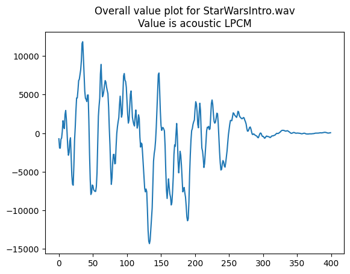
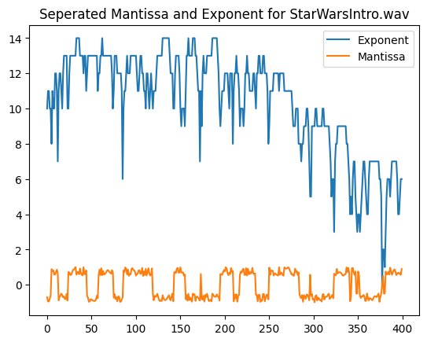
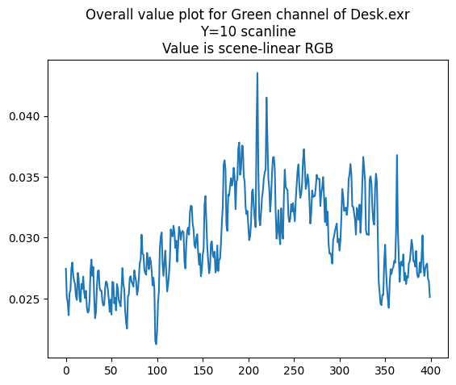
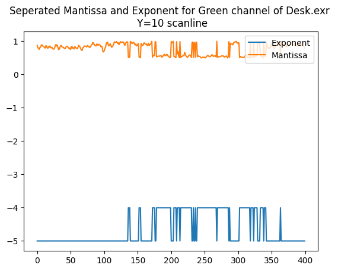

## Signals in image and sound

I have a difficult time motivating the point around the idea that a general-purpose compressor is not the best for EXR's floating point encoded visual image.
The idea revolves around the fact that visual image data, especially those real-world photographic data encoded in R-G-B, should have their own peculiar properties in the `half` numerical stream.
If the compression method does not exploit those peculiar properties (and operates without assuming these properties exist), then it can be reasonable to say that these general-purpose compression methods do not achieve the (theoretically) best performance on EXR datasets.

But what are these properties? I'm trying to make an intuitive example of how a --

1. Visual Image
2. From real-world photography (e.g.not synthesized test data like checker-boards)
3. Encoded in R-G-B floating point. 
(I'm not distinguishing between `half` and `float` yet, but the point here is that the data is in the format of floating point numbers, e.g. Sign-Exponent-Mantissa, in contrast to integer or anything else.)

 -- bytestream would appear different from a **compression** point of view. 

After a few days, I had an idea of comparing visual images against sound files. 
The line could be drawn here because sound files are simply a 1D series of numbers (and it has "channels" too!) while images are 2D. 

Here is the experiment:

This is a wave file, single channel, sampled at 22050Hz. It is the Star Wars "Imperial Marching" sound track!

[starwars.wav](../resources/starwars1.wav)

Now, taking the first part of the sound clip, and plotting the first 800 values. These values are [LPCM](https://en.wikipedia.org/wiki/Pulse-code_modulation). 
In simple language, it is the amplitude of the sound at that exact moment.

Next, we break down this numerical data stream into each number's exponent and mantissa part.
Note that in LPCM the pulse amplitude can be negative, but we ignored the sign bit.

Note here, in particular, how the exponent plot appears highly oscillatory since the LPCM value traverse-pass the zero line many times.

Next, we take a look at these plots for the "Desk.exr" example file from the website

Here is an overall value plot of the Green channel at a scanline:

While it appears it has even more oscillation than the sound file, here is the exponent-mantissa breakdown:

The exponent part only took two values, namely -4 and -5, throughout the scanline. 
There are some boundaries when the number goes back and forth between these two numbers, but there were also many "flat" regions where the exponent can be easily compressed into a token plus a repetition count.
This does not happen anywhere with the sound file.

---------

In real-life scenarios, as we know, acoustic streams are mostly treated and compressed in the Fourier domain rather than in the time domain, especially for human-made music, which is constructed from artificial harmonic sounds (musical instruments). 
But this illustrates the importance of understanding the signal itself -- nobody would just apply a baseline Huffman coding (zip) on top of a PCM sound file and expect extremely good encoding results! 
Obviously purposely made (lossy or lossless) acoustic codecs would be required in processing these files.

